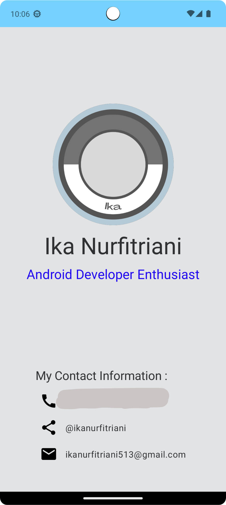

# BusinessCardApp
Hai, perkenalkan saya Ika Nurfitriani! Repositori ini merupakan hasil latihan projek kelas dengan referensi berasal dari codelab. Hasil projek berupa projek aplikasi Android yang diberi nama Business Card App. Aplikasi ini menampilkan sebuah kartu nama.

# Fitur-Fitur
- Home: Aplikasi menampilkan kartu nama saya yang berisi logo, nama, minat, nomor telepon, link github dan email.

# Screenshot Aplikasi
Berikut ini adalah hasil screenshot dari aplikasi Business Card App:

## Author
[@Ika Nurfitriani](https://github.com/ikanurfitriani)